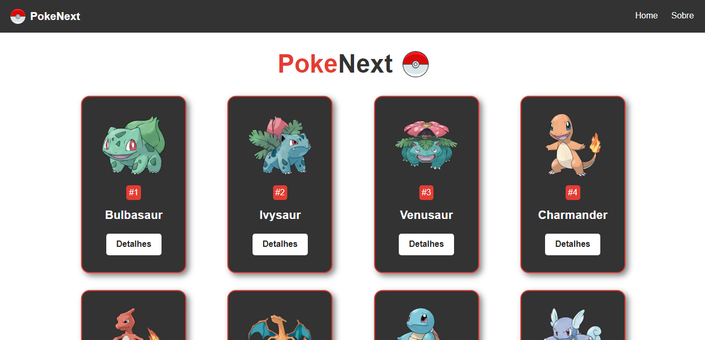

  <a href="#-tecnologias">Tecnologias</a>&nbsp;&nbsp;&nbsp;|&nbsp;&nbsp;&nbsp;
  <a href="#-projeto">Projeto</a>&nbsp;&nbsp;&nbsp;|&nbsp;&nbsp;&nbsp;
  <a href="#-layout">Layout</a>&nbsp;&nbsp;&nbsp;

 

  

## 🚀 Tecnologias

Esse projeto foi desenvolvido com as seguintes tecnologias:

- React
- Typescript
- Next
- Styled Components

## 💻 Projeto

Este projeto foi desenvolvido para aprendizado de conceitos primordias do framework Next. Mostra uma lista de pokemons de uma API, permitindo a consulta de dados especificos de cada Pokemon.

## 🔖 Layout

Este layout foi idealizado por Matheus Battisti que ministra aulas sobre diversas tecnologias no youtube através do [canal Hora de Codar.](https://youtube.com/playlist?list=PLnDvRpP8BnezfJcfiClWskFOLODeqI_Ft)

Code by Renato Sousa